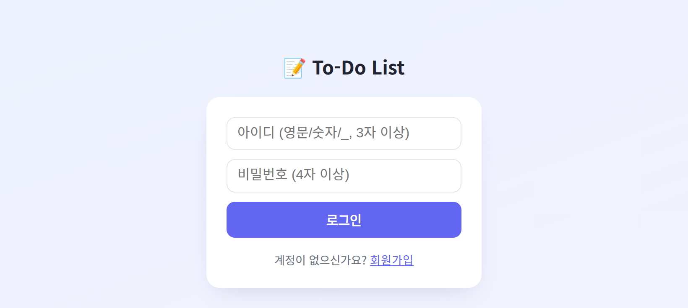
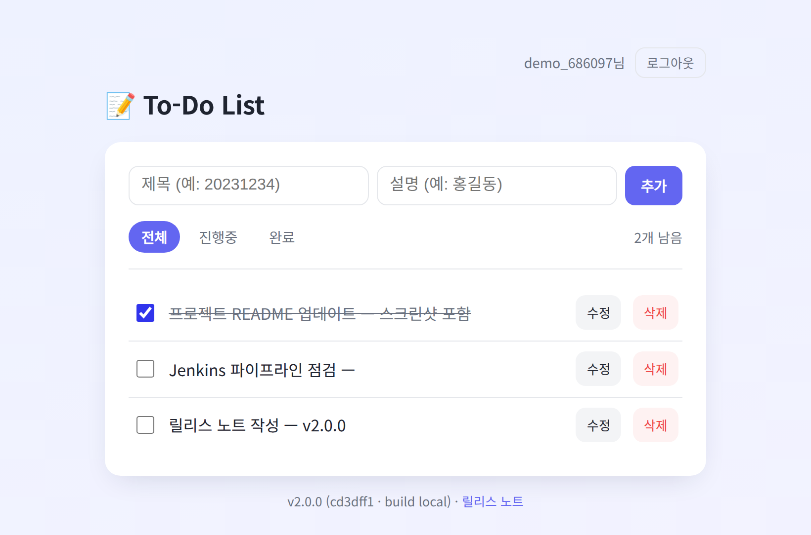
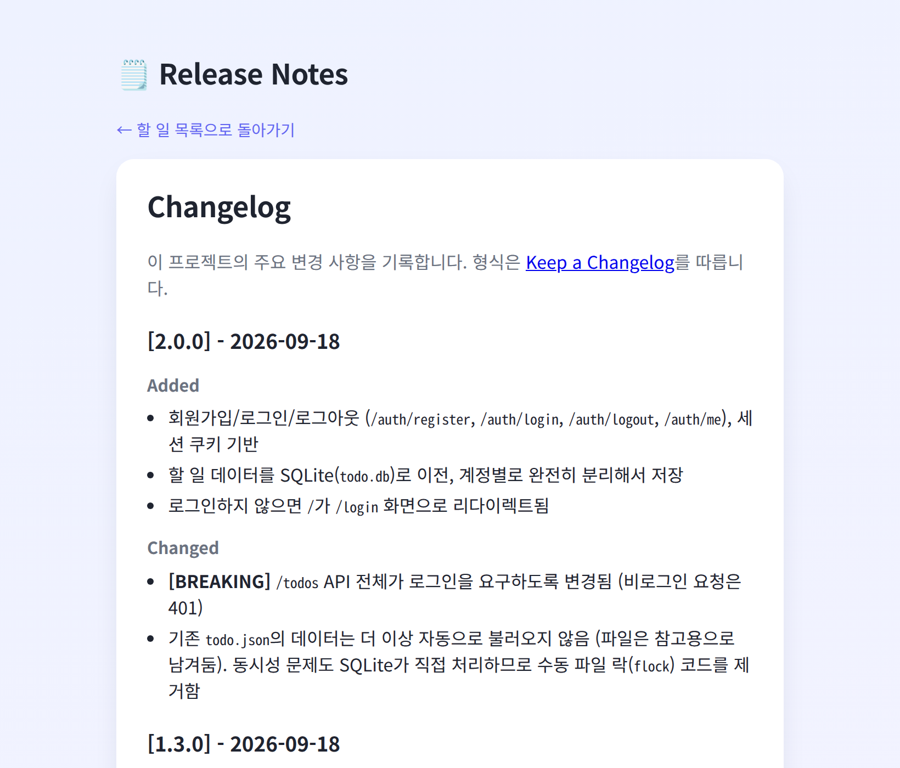

# To-Do List (FastAPI)

계정별로 할 일을 관리하는 간단한 To-Do List 웹앱입니다. FastAPI + SQLite로 만들었고, Docker 컨테이너로 패키징해서 Jenkins로 배포합니다.

| 로그인 | 할 일 목록 | 릴리스 노트 |
| --- | --- | --- |
|  |  |  |

## 주요 기능

- 회원가입 / 로그인 / 로그아웃 — 세션 쿠키 기반, 계정별로 할 일이 완전히 분리됩니다
- 할 일 추가 / 목록 조회(전체·진행중·완료 필터) / 인라인 수정 / 삭제
- 모바일 화면 대응 (iOS 자동 확대 방지, 좁은 화면 레이아웃)
- 현재 버전 및 릴리스 노트 확인 (`GET /api/version`, `GET /release-notes`)
- 배포/모니터링용 헬스체크 (`GET /health`), Docker `HEALTHCHECK`로 `docker ps`에 `healthy` 표시
- 재배포해도 계정·할 일이 유지되도록 데이터를 Docker 볼륨(`/app/data`)에 저장

## 기술 스택

- **FastAPI** + **Uvicorn**
- **SQLite** — 계정(`users`)과 할 일(`todos`) 저장, WAL 모드로 다중 프로세스 동시 접근 처리
- **세션 인증** — `itsdangerous` 서명 쿠키, 비밀번호는 PBKDF2(+salt)로 해시 저장
- **pytest** — 인증 플로우, 계정 간 데이터 격리 포함 테스트
- **Docker** / **Docker Compose** — `python:3.13-slim` 기반, root가 아닌 `appuser`로 실행
- **Docker Hub** — 배포 이미지 저장소 (`lucatonikroos/fastapi-app`)
- **Jenkins** — CI/CD 파이프라인, 빌드 실패 시 이메일 알림

## 프로젝트 구조

```
fastapi-app/
├── main.py                  # FastAPI 앱 — 인증 API, 할 일 API
├── Dockerfile               # 컨테이너 이미지 정의
├── .dockerignore            # 이미지에 넣지 않을 파일 (가상환경, DB, 비밀값 등)
├── requirements.txt         # 운영 의존성 (버전 고정)
├── requirements-dev.txt     # 테스트 의존성 (pytest, httpx)
├── VERSION                  # 현재 버전
├── CHANGELOG.md             # 버전별 변경 이력 (Keep a Changelog 형식)
├── conftest.py
├── templates/
│   ├── index.html           # 할 일 목록 화면
│   ├── login.html           # 로그인 / 회원가입 화면
│   └── release_notes.html   # 릴리스 노트 화면
└── tests/
    └── test_main.py
docker-compose.yml           # compose 배포 설정 (포트·컨테이너 이름·볼륨)
jenkins/                     # Jenkins 배포 파이프라인 (아래 '배포' 참고)
Jenkinsfile                  # CI 파이프라인 (Install → Test → Deploy, uvicorn 직접 실행)
Report/                      # 주차별 과제 보고서 캡처
```

## 로컬에서 실행하기

```bash
cd fastapi-app
python3 -m venv myenv
source myenv/bin/activate
pip install -r requirements.txt -r requirements-dev.txt
uvicorn main:app --reload
```

`http://localhost:8000` 접속 → 로그인 화면으로 이동합니다. 회원가입 후 바로 이용할 수 있습니다.

## Docker로 실행하기

```bash
docker compose up -d --build        # http://localhost:5001
docker compose ps                   # STATUS가 (healthy)면 정상
docker compose down                 # 중지 (데이터 볼륨은 유지, 지우려면 -v)
```

| 환경변수 | 기본값 | 설명 |
| --- | --- | --- |
| `HOST_PORT` | `5001` | 외부 포트 (compose) |
| `CONTAINER_NAME` | `FastApi-app` | 컨테이너 이름 — 공용 서버에서는 겹치지 않게 지정 |
| `DATA_DIR` | 앱 폴더 (Docker: `/app/data`) | `todo.db`, `.session_secret` 저장 위치 |
| `BUILD_NUMBER` | `local` | 화면 하단/`/api/version`에 표시되는 빌드 번호 (Jenkins가 전달) |
| `GIT_COMMIT` | `unknown` | 화면 하단/`/api/version`에 표시되는 커밋 (Jenkins가 전달) |
| `SESSION_SECRET` | 자동 생성 | 세션 쿠키 서명 키 (지정하지 않으면 `DATA_DIR/.session_secret`에 생성) |

## 테스트

```bash
cd fastapi-app
pytest -v
```

## 버전 관리 & 릴리스

- 현재 버전은 `fastapi-app/VERSION`, 변경 이력은 `fastapi-app/CHANGELOG.md`에서 관리합니다.
- 배포마다 `vX.Y.Z` 형태의 git tag를 남기고, 제출/배포 버전은 GitHub Release로 등록합니다.
- 앱이 떠 있는 동안에는 `/api/version`(현재 버전·커밋·빌드 번호)과 `/release-notes`(변경 이력)에서 바로 확인할 수 있습니다.

## 배포 (Jenkins)

Docker 기반 배포 파이프라인 4개를 Jenkins Pipeline job으로 등록해 사용합니다. 스크립트는 `jenkins/` 폴더에 있습니다.

| 파이프라인 | 방식 | 대상 | 주소 |
| --- | --- | --- | --- |
| [`deploy-compose.groovy`](jenkins/deploy-compose.groovy) | 배포 서버에서 GitHub clone → `docker compose up --build` | 본인 서버 | http://163.239.77.80:5001 |
| [`deploy-dockerhub.groovy`](jenkins/deploy-dockerhub.groovy) | Jenkins에서 이미지 빌드 → Docker Hub push → 배포 서버에서 pull → `docker run` | 본인 서버 | http://163.239.77.80:5002 |
| [`deploy-compose-team.groovy`](jenkins/deploy-compose-team.groovy) | compose 방식 | 팀 서버 | http://163.239.77.76:8022 |
| [`deploy-dockerhub-team.groovy`](jenkins/deploy-dockerhub-team.groovy) | Docker Hub pull 방식 | 팀 서버 | http://163.239.77.76:8023 |

- 필요한 Jenkins 자격증명: `deploy-key`(배포 서버 SSH 키), `dockerhub-credentials`(Docker Hub 사용자명 + Personal Access Token)
- 필요한 플러그인: Docker Pipeline, SSH Agent, Email Extension
- 배포 서버 호스트 키는 Jenkins의 `known_hosts`에 미리 등록합니다 (`StrictHostKeyChecking=no` 사용 안 함).
- 팀 서버는 여러 명이 함께 쓰므로 컨테이너 이름·배포 폴더에 `-yunha`를 붙이고, 배정된 포트(8022/8023)만 사용합니다.
- Docker Hub 이미지 태그는 Jenkins 빌드 번호(`:N`, 팀 서버 작업은 `:team-N`)와 `:latest` — 번호 태그로 롤백할 수 있습니다.
- `deploy-compose.groovy`는 빌드 실패 시 담당자 이메일로 실패 알림(로그 첨부)을, 이후 다시 성공하면 복구 알림을 보냅니다. (Jenkins 관리 → System에서 SMTP 설정 필요)

저장소 루트의 `Jenkinsfile`은 이전 주차의 uvicorn 직접 배포 파이프라인(Install → Test → Deploy)입니다.
